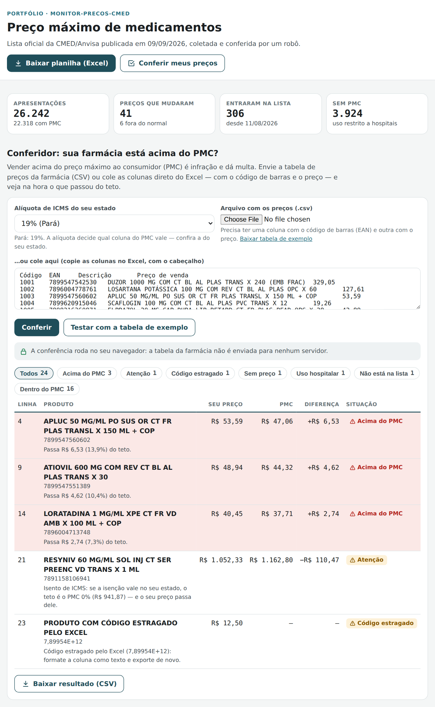
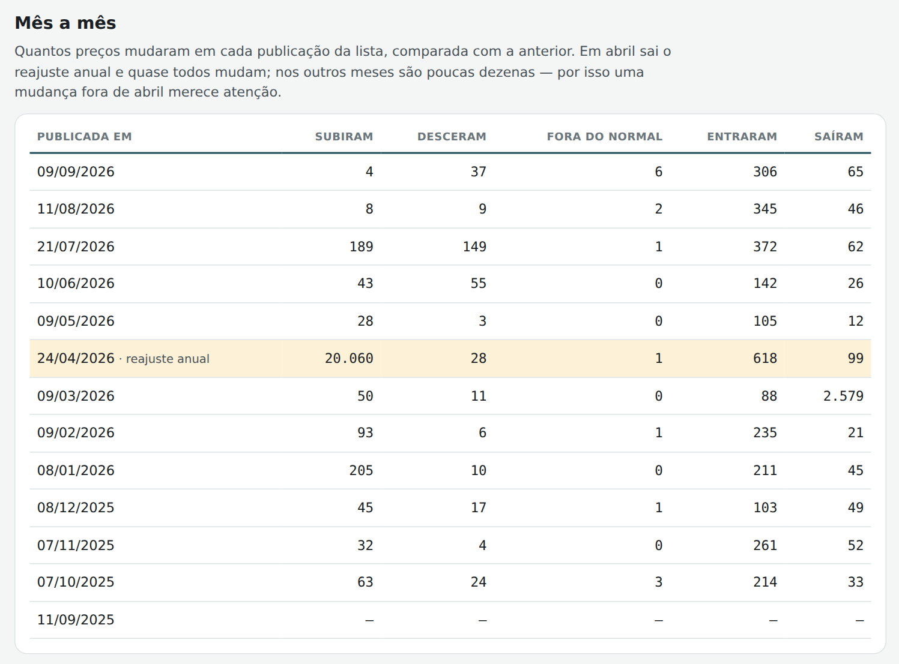
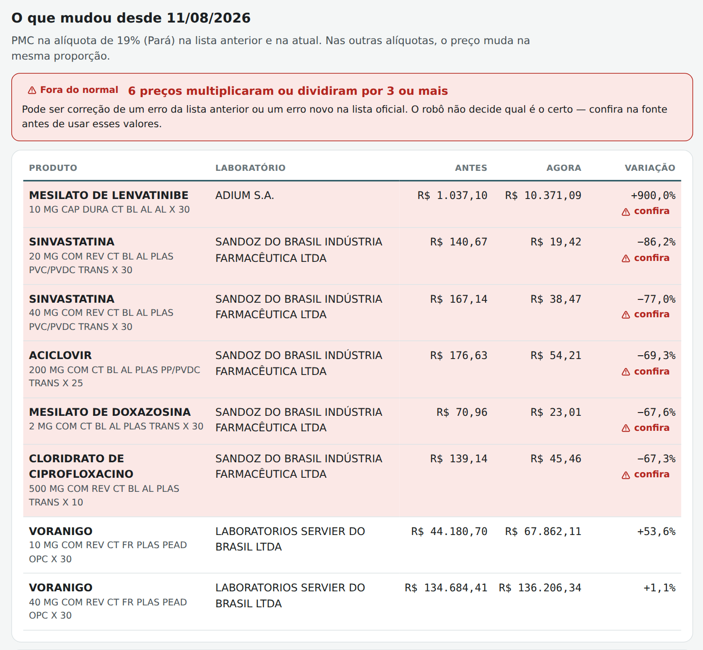

# Monitor de Preços CMED (robô de web scraping + conferidor de preços)

Projeto de portfólio: um robô em Python que **entra todo dia no site da
Anvisa**, acha a lista oficial de preços máximos de medicamentos (CMED),
baixa, limpa, compara com a lista anterior e publica uma página com um
**conferidor**: a farmácia envia a própria tabela de preços e vê na hora
o que está acima do preço máximo permitido.

**Publicado em [monitor-precos-cmed.vercel.app](https://monitor-precos-cmed.vercel.app)**
— atualiza sozinho quando a Anvisa publica uma lista nova.

<p align="center">
  
</p>

> **Em resumo (pra quem não é da área técnica):** farmácia e drogaria não
> podem vender remédio acima do PMC (preço máximo ao consumidor), que o
> governo publica numa planilha enorme — mais de 26 mil apresentações — e
> atualiza quase todo mês. Conferir isso à mão é inviável, e vender acima
> dá multa. Este robô baixa a lista oficial sozinho assim que ela sai,
> avisa o que mudou de preço, e a farmácia confere a tabela inteira em
> segundos, sem mandar os próprios dados para lugar nenhum.

## O problema de verdade

O PMC muda: todo abril sai o reajuste anual, e nos outros meses entram
produtos novos, saem outros e alguns preços são corrigidos. A lista
oficial é publicada numa planilha que não vem pronta para uso — e isso
não é suposição, veio do arquivo real (lista de 09/09/2026):

| O que vem no arquivo oficial | O que daria errado sem tratamento |
|---|---|
| 41 linhas de notas antes do cabeçalho | Quem abre direto no pandas lê as notas como se fossem produtos |
| Todos os preços como **texto** (`"1234,56"`), alguns com asterisco (`"54,23*"`) | Soma e comparação viram comparação de texto: `"9,90"` fica "maior" que `"10,00"` |
| 1.147 produtos isentos de ICMS, mas só **420** com o asterisco que a própria lista promete | Quem confia no asterisco erra 727 produtos |
| 55.968 campos vazios preenchidos com um traço (`"    -     "`) | O traço vira "código de barras" e "tarja" |
| 3.924 produtos de uso hospitalar **sem PMC** em nenhuma alíquota | Somem da conferência, ou aparecem com preço zero |
| 138 códigos de barras repetidos em mais de uma apresentação, 3 zerados (`0000000000000`) e 99 com dígito verificador errado | O conferidor casaria o produto errado |
| Um PMC por alíquota de ICMS: 13 alíquotas, mais 12 colunas de Área de Livre Comércio | Conferir na coluna errada dá multa ou falso alarme |

## Como o robô funciona

```
gov.br/anvisa/.../cmed/precos          dados/                        public/ (Vercel)
  página de preços  ──(1) acha o link──►  listas/AAAA-MM-DD.csv.gz  ──►  página com conferidor
  arquivo PMC - xls ──(2) baixa, confere, precos/AAAA-MM-DD.csv.gz       dados/*.json
                          limpa ────────►  fontes.json (url, sha256)     lista-cmed.xlsx
```

1. **Todo dia às 08:17 (Belém)** o GitHub Actions abre a página de preços
   da Anvisa e procura o link `xls_conformidade_site_AAAAMMDD_*.xlsx` (a
   lista "site" é a de PMC; a "gov" é a de compras públicas).
2. **Se é uma lista nova**, baixa (12 MB), confere se é mesmo uma planilha,
   lê, limpa e guarda em `dados/` — com o endereço de origem e o sha256
   do arquivo baixado, para qualquer número ser rastreável.
3. **Compara com a lista anterior** pelo código GGREM (único por
   apresentação): o que subiu, desceu, entrou e saiu.
4. **Publica** a página e a planilha; a Vercel republica o site sozinha.
   Se não saiu lista nova, não faz nada.

A primeira carga buscou as 12 listas anteriores na página de arquivo da
Anvisa (setembro/2025 a agosto/2026), e o histórico mostra o que
esperava ver:

<p align="center">
  
</p>

## O que a página mostra

- **Conferidor**: a farmácia escolhe a alíquota de ICMS (Pará: 19%), envia
  a tabela (CSV) ou cola as colunas do Excel, e vê cada produto: acima do
  PMC (com quanto passou), dentro, isento de ICMS acima do PMC 0%, uso
  hospitalar, código que não está na lista. Dá para baixar o resultado.
  Tem uma [tabela de exemplo](exemplos/tabela-drogaria-exemplo.csv) com
  produtos reais para testar.
- **O que mudou** desde a lista anterior, com as variações fora do normal
  em destaque.
- **Mês a mês**: quantos preços mudaram em cada publicação.
- **Busca** por nome, substância, laboratório ou código de barras.
- **Qualidade da lista oficial**: o que o robô encontrou e corrigiu.
- **Planilha** com as mudanças, os produtos novos e os que saíram, e a
  lista completa com o PMC em cada alíquota.

<p align="center">
  
</p>

### O robô encontrou possíveis erros na lista oficial

Entre agosto e setembro de 2026, o PMC do **Mesilato de Lenvatinibe 10 mg**
passou de R$ 1.037,10 para R$ 10.371,09 — praticamente 10 vezes, como uma
vírgula no lugar errado. No mesmo período, a Sinvastatina 20 mg de um
laboratório caiu de R$ 140,67 para R$ 19,42. O robô marca como **fora do
normal** todo preço que multiplicou ou dividiu por 3 ou mais, e **não
decide qual é o certo**: pode ser a correção de um erro anterior ou um erro
novo. Quem usa a informação confere na fonte.

## Feito pra site real, não pra exemplo

Tudo abaixo foi testado (`testes/`) ou aconteceu de verdade durante o
desenvolvimento:

- **A página da Anvisa mudou de layout**: o robô não acha o link, para com
  erro e o GitHub avisa por e-mail. O site continua com a última lista boa.
- **Link falso ou redirecionamento**: só baixa de `https://www.gov.br`,
  mesmo que a página aponte um arquivo com o nome certo em outro site ou
  que o servidor redirecione para fora; arquivo acima de 100 MB (o real
  tem 12 MB) é recusado.
- **Veio uma página de erro no lugar da planilha**: detectado antes de
  ler (um `.xlsx` é um zip; HTML não é).
- **Conexão caiu no meio do download**: tenta de novo, até 3 vezes, com
  espera crescente, e cada download tem prazo máximo.
- **Lista corrigida publicada no mesmo dia**: o robô reconhece lista nova
  pelo nome do arquivo, não pela data, então uma republicação entra.
- **Cabeçalho em outra linha, coluna renomeada, preço em formato
  desconhecido**: o cabeçalho é procurado, não assumido; faltando coluna
  obrigatória ou com mais de 1% dos preços ilegíveis, o robô para.
- **Lista muito menor que a anterior** (menos de 80% dos produtos):
  provável arquivo cortado; não publica.
- **Mesmo código GGREM em duas linhas**: aconteceu nas listas de
  setembro e outubro de 2025 (dois remédios diferentes com o mesmo
  código). Ver "Bugs reais".
- **Educação com o site**: o robô se identifica, faz uma requisição por
  vez com pausa, e o `robots.txt` do gov.br permite robôs nessas páginas
  (conferido em setembro de 2026). Numa semana normal, ele abre uma
  página por dia; o arquivo de 12 MB só é baixado quando muda.

Do lado da farmácia, o conferidor aceita o que aparece em tabela de
verdade: `;`, `,` ou tab (colado do Excel); `R$ 1.234,56`, `1234.56` ou
`12,9`; coluna "Código" (interna) junto com "EAN" (usa o EAN); arquivo
salvo pelo Excel no Windows (cp1252); código de barras transformado pelo
Excel em `7,89111E+12` (avisa que o código se perdeu, em vez de adivinhar);
código que perdeu o zero à esquerda.

## Segurança e privacidade

- **A tabela da farmácia não sai do computador.** A conferência roda no
  navegador; não existe servidor recebendo arquivo. Preço de venda é
  informação comercial sensível.
- **Nada de HTML vindo de fora**: nome de produto (da lista oficial ou da
  tabela da farmácia) entra na página sempre como texto, e a página tem
  Content-Security-Policy que só permite scripts do próprio site.
- **Injeção de fórmula**: o CSV do resultado protege células que começam
  com `=`, `+`, `-` ou `@` (um produto cadastrado como
  `=HYPERLINK(...)` não vira link no Excel de quem abrir), e a planilha
  publicada grava todo texto como texto. Os dois casos têm teste.
- **Workflow**: o número de listas antigas digitado ao rodar à mão é
  validado e passado por variável de ambiente, não colado no comando;
  cada job tem só a permissão que usa (o de testes só lê).

## Decisões de projeto

- **Preço em centavos (número inteiro)** do começo ao fim: sem erro de
  arredondamento de ponto flutuante numa comparação que decide multa.
- **Código de barras em mais de uma apresentação com PMC diferente**: vale
  o menor, e o conferidor avisa. É o teto mais seguro para quem vende.
- **Isento de ICMS**: a lista mostra preço em todas as alíquotas; o
  conferidor compara com a alíquota escolhida e avisa quando o preço passa
  do PMC 0%, que é o teto onde a isenção vale. Se a isenção vale no estado
  é decisão fiscal da farmácia, não do robô.
- **Alíquota padrão de 19% (Pará**, Lei 9.755/2022, em vigor desde
  16/03/2023), com todas as outras disponíveis. A própria CMED avisa que
  conferir a alíquota do estado é responsabilidade do comerciante.
- **A página baixa só o necessário**: o catálogo compacto (500 KB
  comprimido) e o PMC da alíquota escolhida; as outras alíquotas vêm sob
  demanda.
- **Guarda só as duas últimas listas completas** (as antigas continuam no
  histórico do git) e o PMC de todas as publicações, que é pequeno.
- **Saída idêntica a cada execução**: com os mesmos dados, os arquivos
  saem byte a byte iguais (testado em Python 3.11 e 3.12). O robô só faz
  commit quando algo mudou, e o CI confere em cada push se `public/` bate
  com o que o código gera.

## Bugs reais encontrados no processo

1. **O robô travou ao explorar o site.** Na primeira versão da sondagem,
   o script abria em sequência, sem pausa, todas as subpáginas do arquivo
   de listas antigas (a principal pesa 1,1 MB e leva 14 s para carregar).
   Passou de 25 minutos e cancelei. A versão final faz uma requisição por
   vez, com pausa e prazo máximo por download, e mostra o andamento.
2. **Lista antiga com código repetido.** A primeira carga de histórico
   parou na lista de 11/09/2025: o código GGREM 541821110172303 aparecia
   para dois remédios diferentes (NARATRIN e DOXPROVIR). As listas
   recentes não tinham isso, e eu tinha tratado o código como sempre
   único. Agora linha idêntica é descartada, código repetido com dados
   diferentes fica com o menor PMC e vai para o registro de qualidade, e
   o robô só para se isso passar de 5 casos ou 1% da lista. A própria
   Anvisa corrigiu em novembro de 2025.
3. **Asterisco não confiável.** A nota da lista diz que produtos isentos
   de ICMS têm preço com asterisco, mas só 420 dos 1.147 têm. O robô usa
   a coluna "ICMS 0%" e ignora o asterisco.
4. **Zero à esquerda do código de barras.** O Excel apaga o zero inicial
   de um EAN-13, que vira 12 dígitos. Minha primeira correção só repunha o
   zero se o código de 12 dígitos fosse inválido — mas o zero à esquerda
   não muda o dígito verificador, então ele sempre parecia válido e a
   correção nunca acontecia. O teste pegou.
5. **Teste com premissa errada.** Usei um código de 14 dígitos da própria
   lista oficial como exemplo de código válido; o teste falhou porque o
   código da lista é que tem o dígito verificador errado (é um dos 99).
6. **Coluna errada na tabela da farmácia.** Tabela com "Código" (código
   interno) antes de "EAN" fazia o conferidor pegar o código interno.
   Agora os nomes são procurados do mais específico para o mais genérico,
   e há aviso se a coluna escolhida não tiver cara de código de barras.
7. **Números que não batiam na página.** O cartão "uso hospitalar" dizia
   3.931, e a seção de qualidade, 3.924 sem PMC: 7 produtos marcados como
   hospitalares ainda têm PMC. O cartão passou a contar o que importa
   para a farmácia: produtos sem PMC.
8. **Detalhes da planilha**: sem configuração de impressão, cada coluna
   saía numa folha; variação de +0,04% aparecia como "+0,0%".

Testes: 23 do robô em Python (lista no formato real do arquivo oficial,
com as mesmas 74 colunas; página real da Anvisa como fixture; download
com conexão caindo e redirecionamento para fora) e 11 do
conferidor em JavaScript, rodando no CI a cada push. Página conferida de
390px a 1280px, temas claro e escuro, sem rolagem horizontal.

## Limitações (honestas)

- É ferramenta de apoio: não substitui a consulta à lista oficial nem
  decide questão fiscal (alíquota, isenção).
- O conferidor encontra produto pelo código de barras. Produto sem
  código, ou com código diferente do registrado na CMED, aparece como
  "não está na lista".
- O GitHub desliga tarefas agendadas de repositório sem atividade há 60
  dias. Como a Anvisa publica lista quase todo mês e cada lista nova vira
  um commit do robô, isso não deve acontecer; se acontecer, basta
  reativar em Actions.

## Estrutura

```
monitor-precos-cmed/
├── robo/
│   ├── rodar.py          -> o robô: confere a página, baixa, processa e publica
│   ├── coleta.py         -> acha o link na página e baixa com cuidado
│   ├── lista.py          -> lê e limpa o arquivo oficial, registra o que corrigiu
│   ├── comparar.py       -> o que mudou entre duas listas, histórico mês a mês
│   ├── dados.py          -> o que fica guardado em dados/
│   ├── publicar.py       -> dados da página e planilha
│   └── gerar_exemplo.py  -> gera a tabela de exemplo (drogaria fictícia)
├── dados/                -> listas limpas, histórico de PMC e origem de cada arquivo
├── public/               -> o site (index.html, app.js, conferidor.js) e os dados publicados
├── exemplos/             -> tabela de preços de exemplo para o conferidor
├── testes/               -> testes do robô (unittest) e do conferidor (node --test)
├── docs/                 -> imagens deste README
└── .github/workflows/robo.yml
```

## Stack

Python 3 com openpyxl e defusedxml (versões fixadas em
`requirements.txt`); coleta só com a biblioteca padrão (`urllib`,
`html.parser`). Página em HTML/CSS/JavaScript puro. Automação no GitHub
Actions; publicação na Vercel.

---

Dados: [Listas de preços de medicamentos — CMED/Anvisa](https://www.gov.br/anvisa/pt-br/assuntos/medicamentos/cmed/precos),
informação pública. A drogaria da tabela de exemplo é fictícia; os
produtos e preços máximos são reais.
